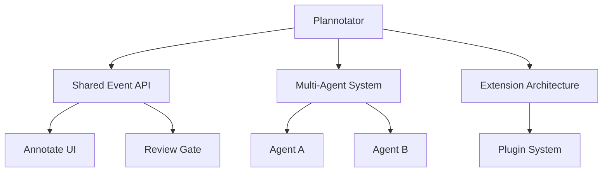
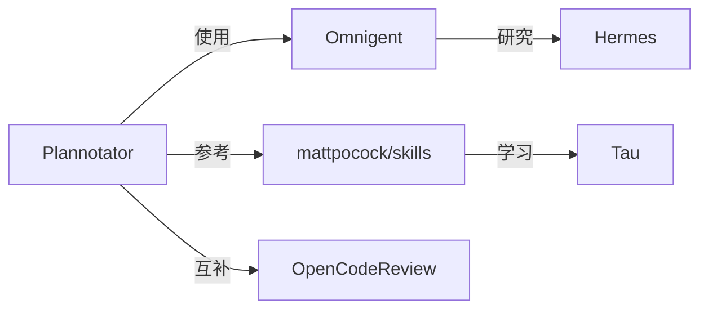

# Knowledge Garden Visual Map

為 Notion 知識花園的種子和專題產生視覺地圖。

## 兩種視覺地圖

### 🌱 種子地圖（內部結構圖）
- 展示一顆種子內部的概念組成和關聯
- 例如：Plannotator 的 Shared Event API、Multi-Agent、Extension 系統等組件的關聯
- 用 Mermaid 畫 → 轉 SVG/PNG → 上傳 Notion

### 🔬 專題地圖（概念關聯圖）
- 展示一個專題內所有概念（種子）之間的關聯
- 例如：AI Agent 架構研究 → Pi、Tau、Hermes、Waku 等框架的關聯
- 用 Mermaid 畫 → 轉 SVG/PNG → 上傳 Notion

## 流程

### 1. 決定地圖類型

根據使用者需求決定：
- 「幫 Plannotator 畫地圖」→ 種子地圖
- 「畫 AI Agent 架構研究的關聯圖」→ 專題地圖

### 2. 收集資料

**種子地圖：**
1. 讀取種子的 Notion 頁面內容
2. 讀取對應的 wiki 頁面（如果有）
3. 提取：概念名稱、組成部分、關聯關係

**專題地圖：**
1. 讀取專題的 Notion 頁面
2. 查詢所有相關種子
3. 讀取每顆種子的內容
4. 提取：種子名稱、成長狀態、互相關聯

### 3. 產生 Mermaid 圖

**種子地圖 Mermaid 範例：**


**專題地圖 Mermaid 範例：**


### 4. 轉換為圖片

使用 Pi 的 Mermaid 渲染能力：
1. 將 Mermaid 程式碼寫入 `.mmd` 檔案
2. 使用 Mermaid CLI 轉為 SVG/PNG：
   ```bash
   npx @mermaid-js/mermaid-cli mmdc -i input.mmd -o output.svg -t dark
   ```
3. 或者使用線上 API：
   ```bash
   curl -X POST https://mermaid.ink/svg -H "Content-Type: application/json" -d '{"code":"..."}' > output.svg
   ```

### 5. 上傳到 Notion

**方法 A：上傳為圖片**
1. 使用 `ntn files create` 上傳 SVG/PNG
2. 在 Notion 頁面插入 Image Block

**方法 B：存到 wiki 並連結**
1. 將 SVG 存到 `wiki/visualizations/`
2. 在 Notion 頁面貼上 URL 連結

### 6. 更新視覺地圖 Database

在視覺地圖 Database 建立/更新記錄：
```bash
ntn api v1/pages -d '{
  "parent": {"database_id": "<視覺地圖 DB ID>"},
  "icon": {"type": "emoji", "emoji": "🗺️"},
  "properties": {
    "名稱": {"title": [{"text": {"content": "地圖名稱"}}]},
    "類型": {"select": {"name": "🌱 種子地圖"}},
    "關聯種子": {"relation": [{"id": "<seed-page-id>"}]},
    "圖片 URL": {"url": "<image-url>"}
  }
}'
```

## 使用範例

### 範例 1：幫 Plannotator 畫種子地圖
```
使用者：幫 Plannotator 畫視覺地圖

→ 讀取 Plannotator Notion 頁面 + wiki 頁面
→ 提取：Shared Event API, Multi-Agent, Extension, Annotator UI, Review Gate
→ 產生 Mermaid 程式碼
→ 轉為 SVG（dark theme）
→ 上傳到 Notion
→ 更新視覺地圖 Database
→ 回報：已完成 Plannotator 視覺地圖
```

### 範例 2：畫 AI Agent 架構研究專題地圖
```
使用者：畫 AI Agent 架構研究的專題關聯圖

→ 讀取專題 Properties
→ 查詢 4 顆相關種子：Plannotator, Omnigent, mattpocock, OpenCodeReview
→ 讀取每顆種子內容
→ 分析關聯：Plannotator 使用 Omnigent 概念、参考 mattpocock、互補 OpenCodeReview
→ 產生 Mermaid 程式碼
→ 轉為 SVG
→ 上傳到 Notion
→ 回報：已完成專題地圖
```

## 視覺地圖 Database Schema

| 欄位 | 類型 | 說明 |
|------|------|------|
| 名稱 | Title | 視覺地圖名稱 |
| 類型 | Select | 🌱 種子地圖 / 🔬 專題地圖 |
| 關聯種子 | Relation | 指向種子（種子地圖用） |
| 關聯專題 | Relation | 指向專題（專題地圖用） |
| 圖片 URL | URL | 上傳後的圖片連結 |
| 建立日期 | Date | 建立時間 |

## 注意事項

- **Mermaid 渲染**：確保 Mermaid 語法正確，避免渲染失敗
- **圖片大小**：SVG 比 PNG 更清晰，但檔案較大；根據 Notion 顯示需求選擇
- **更新機制**：當種子/專題內容變化時，自動重新產生地圖
- **深色/淺色主題**：根據 Notion 使用者偏好選擇 theme

## 相關 Skills

- `knowledge-garden` — 花園維護
- `notion-page-content` — 頁面內容產生
- `notion-cli` — Notion CLI 命令參考
