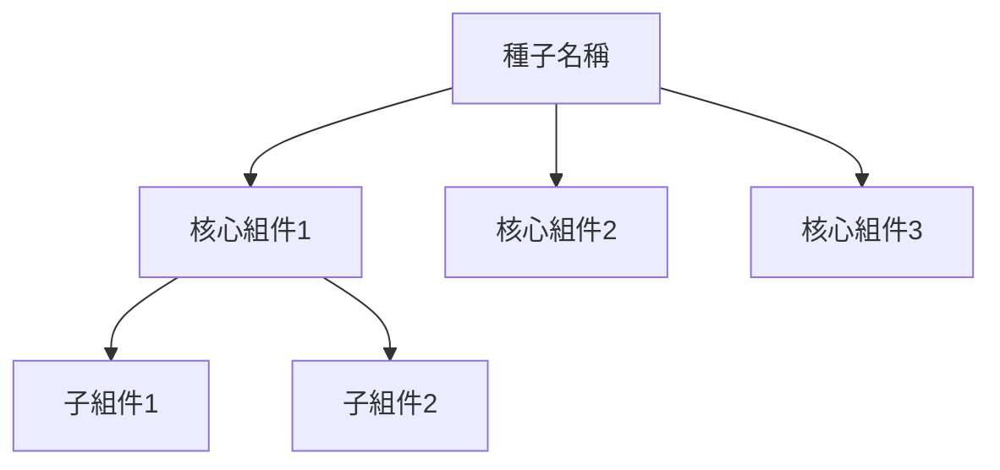
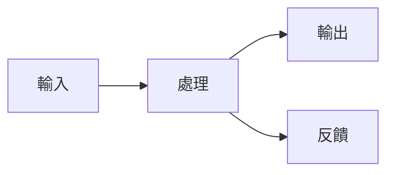
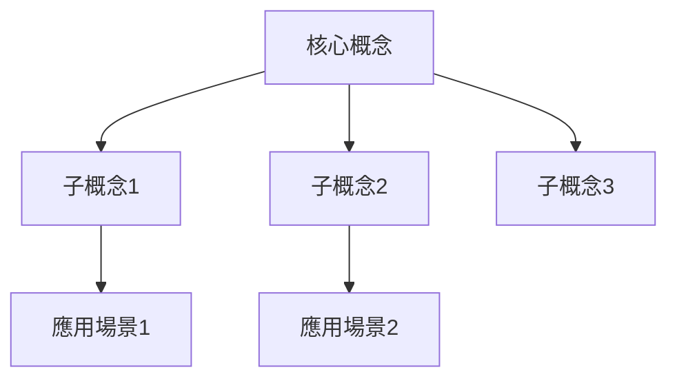
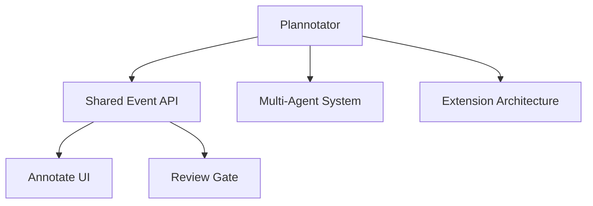
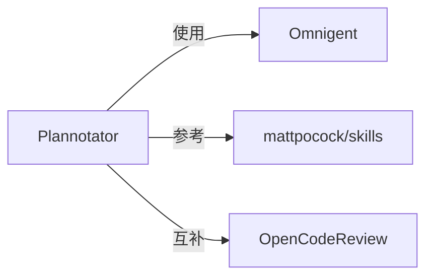

# Knowledge Garden Visual Map

為 Notion 知識花園的種子和專題產生視覺地圖。

## 兩種視覺地圖

### 🌱 種子地圖（內部結構圖）
- 展示一顆種子內部的概念組成和關聯
- 例如：Plannotator 的 Shared Event API、Multi-Agent、Extension 系統等組件的關聯

### 🔬 專題地圖（概念關聯圖）
- 展示一個專題內所有概念（種子）之間的關聯
- 例如：AI Agent 架構研究 → Pi、Tau、Hermes、Waku 等框架的關聯

## 視覺地圖 Database

**位置：** `5f2a0e0f-91de-466f-879e-9042c8a02169`

視覺地圖是一個**索引/註冊表**，不是存放地圖內容的地方。實際內容存在子頁面。

| 欄位 | 類型 | 說明 |
|------|------|------|
| 頁面 | Title | 地圖名稱 |
| 類型 | Select | 專題地圖 / 種子地圖 |
| 關聯種子 | Relation → 種子 DB | 這張圖描述哪顆種子 |
| 關聯專題 | Relation → 專題 DB | 這張圖描述哪個專題 |
| 建立時間 | Created time | 自動 |
| 更新時間 | Last edited time | 自動 |

## 流程

### 1. 決定地圖類型

根據使用者需求決定：
- 「幫 Plannotator 畫地圖」→ 種子地圖
- 「畫 AI Agent 架構研究的關聯圖」→ 專題地圖
- 「幫所有種子畫地圖」→ 批量建立

### 2. 收集資料

**種子地圖：**
1. 讀取種子的 Notion 頁面內容
2. 讀取對應的 wiki 頁面（如果有）
3. 提取：概念名稱、組成部分、關聯關係

**專題地圖：**
1. 讀取專題的 Notion 頁面
2. 查詢所有相關種子
3. 讀取每顆種子的內容
4. 提取：種子名稱、成長狀態、互相關聯

### 2.1 自動從 wiki 產生

**觸發條件：** 使用者說「自動產生」、「從 wiki 產生」、「auto-generate」等。

**流程：**

1. **讀取 wiki 頁面** — 根據種子的 Wiki GitHub 連結讀取 wiki 內容
2. **提取架構資訊** — 從 wiki 內容中提取：
   - 標題和一句話描述
   - 核心組件/概念
   - 組件之間的關係
   - 外部連結
3. **自動生成 Mermaid** — 根據提取的資訊自動產生 Mermaid 語法
4. **人工審閱** — 產生後讓使用者確認/調整

**自動提取範例：**
```
從 wiki/entities/omnigent.md 提取：
- 標題：Omnigent
- 核心組件：Runner、Server、OmniBox
- 關係：Runner 包裝 agents，Server 管理 policies
- 生成 Mermaid：
  graph TD
    A[Omnigent] --> B[Runner]
    A --> C[Server]
    A --> D[OmniBox]
    B --> E[Claude Code]
    B --> F[Codex]
    B --> G[Pi]
```

### 3. 模板系統

**種子地圖模板：**

| 類型 | 適用種子 | 圖表結構 |
|------|---------|----------|
| **架構型** | Omnigent、Pi Agent | 核心組件 + 關聯 |
| **工具型** | Plannotator、OpenCodeReview | 功能模組 + 流程 |
| **知識型** | OKF、mattpocock/skills | 概念分類 + 關聯 |
| **流程型** | NPM Publishing | 步驟流程 |

**架構型模板：**


**工具型模板：**


**知識型模板：**


### 4. 批量建立

**觸發條件：** 使用者說「幫所有種子畫地圖」、「批量建立視覺地圖」等。

**流程：**

1. **查詢所有種子** — 取得 Database 中所有種子列表
2. **篩選需要建立的** — 檢查哪些種子還沒有視覺地圖
3. **依序建立：**
   - 讀取種子內容
   - 選擇模板類型
   - 產生 Mermaid 圖
   - 建立 Notion 頁面
   - 註冊到視覺地圖 Database
   - 連結到種子頁面
4. **產生摘要報告** — 列出所有建立的視覺地圖

**批量建立指令範例：**
```bash
# 查詢所有種子
ntn api v1/data_sources/0785b58a-9976-4163-85be-6854410b6563/query -d '{}'

# 檢查哪些沒有視覺地圖
# 依序建立
```

**種子地圖 Mermaid 範例：**


**專題地圖 Mermaid 範例：**


### 5. 建立 Notion 子頁面 + 註冊

1. 在種子或專題頁面下建立子頁面（icon: 🗺️）
2. **直接寫入 Mermaid code block**（不要轉換為圖片）
3. 在視覺地圖 Database 建立記錄：

```bash
ntn api v1/pages -d '{
  "parent": {"database_id": "5f2a0e0f-91de-466f-879e-9042c8a02169"},
  "icon": {"type": "emoji", "emoji": "🗺️"},
  "properties": {
    "頁面": {"title": [{"text": {"content": "地圖名稱"}}]},
    "類型": {"select": {"name": "種子地圖"}},
    "關聯種子": {"relation": [{"id": "<seed-page-id>"}]}
  }
}'
```

### 6. 更新種子/專題的「視覺地圖頁面」欄位

## 注意事項

- **⚠️ 直接寫入 Mermaid**：不要轉換為 SVG/PNG，直接用 code block 寫入 Notion
- **Mermaid 語法**：確保語法正確，避免渲染失敗
- **更新機制**：當種子/專題內容變化時，直接修改 Mermaid code block
- **模板選擇**：根據種子類型選擇合適的模板
- **自動產生**：優先使用自動從 wiki 產生，減少手動輸入

## 相關 Skills

- `knowledge-garden` — 花園維護
- `knowledge-garden-page-content` — 頁面內容產生
- `notion-cli` — Notion CLI 命令參考

---

## 快速指令參考

| 指令 | 功能 | 範例 |
|------|------|------|
| `幫 <種子> 畫地圖` | 建立單一視覺地圖 | `幫 Omnigent 畫地圖` |
| `自動產生 <種子> 地圖` | 從 wiki 自動產生 | `自動產生 Omnigent 地圖` |
| `幫所有種子畫地圖` | 批量建立 | `幫所有種子畫地圖` |
| `更新 <種子> 地圖` | 更新現有視覺地圖 | `更新 Plannotator 地圖` |
